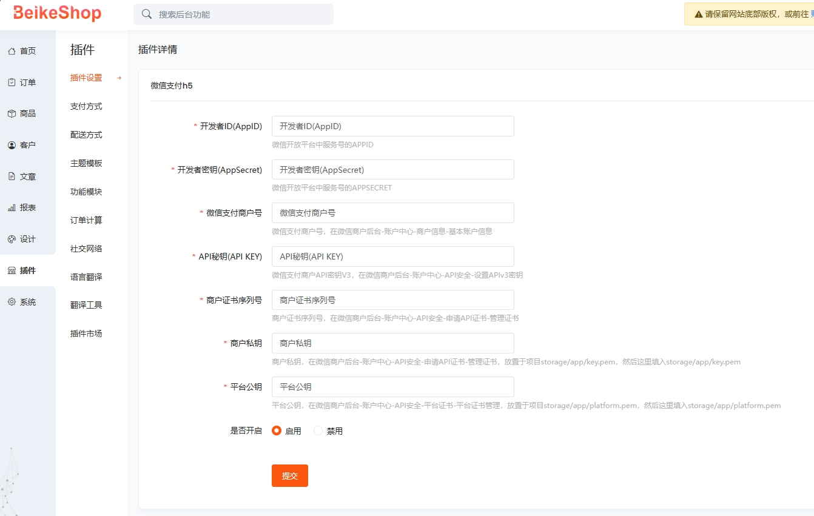

# 贝壳商城(beikeshop)的微信支付h5插件

安装本插件后，可以选择微信收款方式！在PC端展示微信收款码，用手机微信扫码支付，或在手机端浏览器中调起微信客户端进行支付。

**不支持APP内嵌webview或微信公众号内使用**

在使用该插件之前，请按照插件配置页面的字段说明进行配置。

## 配置参数

您需要开通微信商户，微信开放平台，微信服务号，才可以使用扫码支付及H5支付，这部分的操作说明请在微信相关文档寻找帮助，微信相关的认证费用约为600元/年，且需要企业认证。

## 插件说明

本插件基于微信PHP SDK 和 微信支付V3版API 开发：Github：wechatpay-apiv3/wechatpay-php

======后台配置页======

开源地址：https://github.com/shellus/beikeshop-wechat-pay-h5

## 未来计划：

1. 支持公众号内支付
2. 自动获取平台证书
